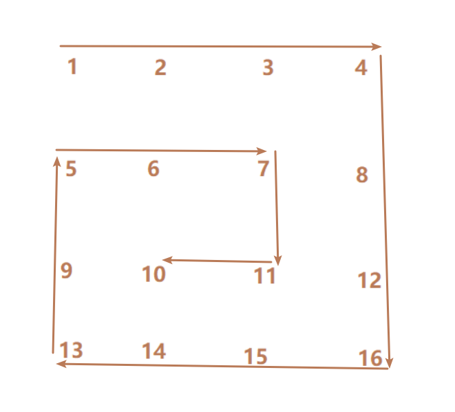

# 根据图中所示我想得到 1,2,3,4,8,12,16,15,14,13,9,5,6,7,11,10，用js 怎么获取数字到数组里面



```javascript
class CircleGet {
  constructor(num) {
    // 如图是4，边的格子数
    this.num = num
    // 当前数字
    this.now = num
    // 目前步数
    this.step = num - 1
    // 是否切换步数
    this.turn = false
    // 不断切换方向
    this.directionLoop = (function* () {
      while(true) {
        yield `right`
        yield `down`
        yield `left`
        yield `up`
      }
    })()
    // 获取初始化方向
    this.direction = this.directionLoop.next().value
  }
  get() {
    let res = Array.from({ length: this.num}, (item, index) => index + 1)
    this.changeDirection()

    while(this.step > 0) {
      for (let i = 0; i < this.step; i++) {
        res.push(this.now += this.getInterval())
      }
      this.nextStep()
    }
    return res
  }
  getInterval() {
    switch(this.direction) {
      case `right`:
        return 1
      case `down`:
        return this.num
      case `left`:
        return -1
      case `up`:
        return -this.num
    }
  }
  changeDirection() {
    this.direction = this.directionLoop.next().value
  }
  nextStep() {
    this.changeDirection()
    if (this.turn) {
      this.step--
    }
    this.turn = !this.turn
  }
}
// test
const c = new CircleGet(3)
console.log(c.get())
```

思路：
步数：

- 2格：1、1、1
- 3格：2、2、2、1、1
- 4格：3、3、3、2、2、1、1
- 5格：4、4、4、3、3、2、2、1、1
- ……

从上面可以发现规律，去掉第1个数字，那么每两个循环减1，直到为0

第一个数字的步数，其实就是第一次从左到右数，也就是1、2、3……直到我们定义的num
